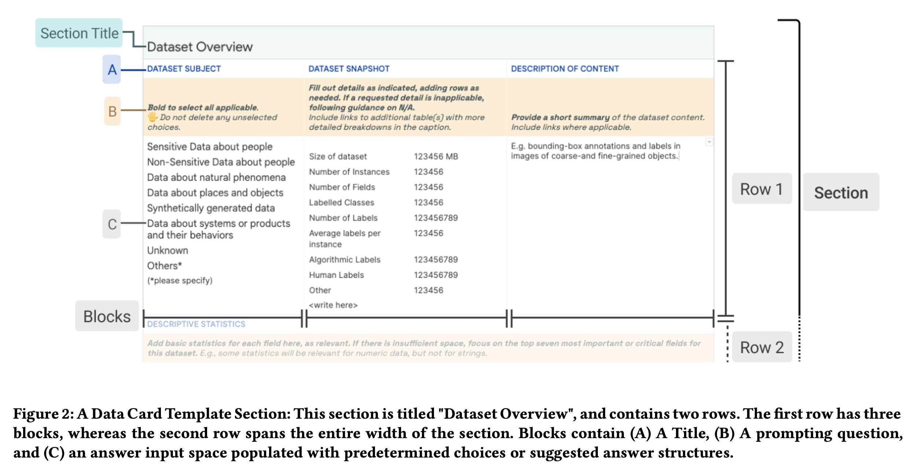
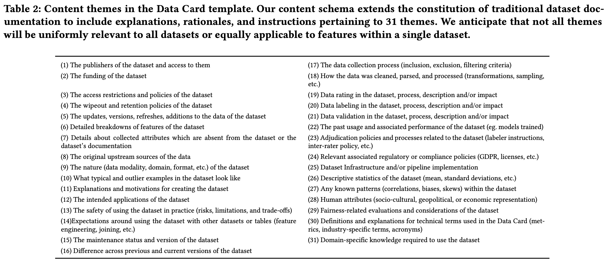
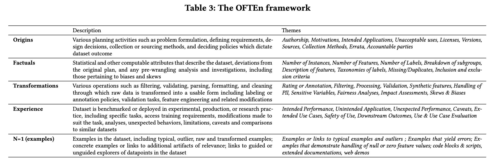
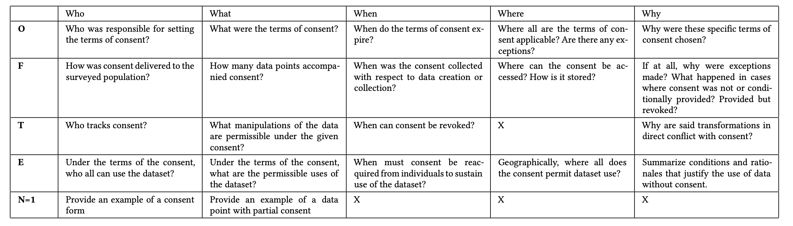
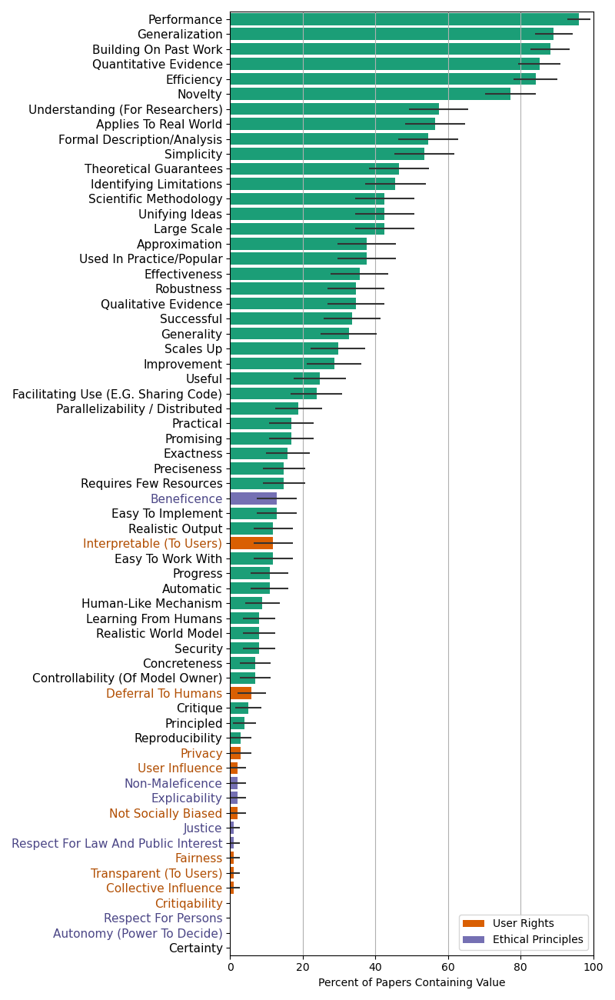
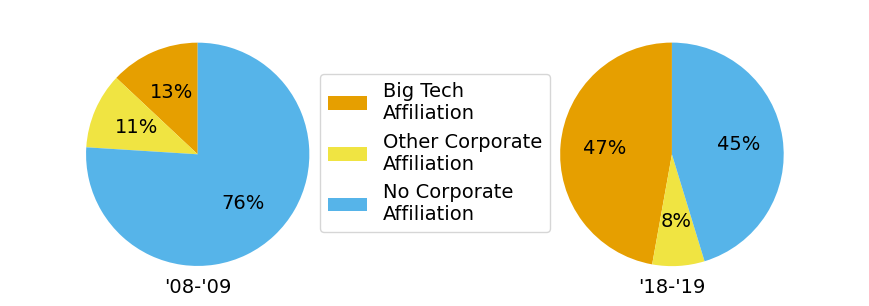
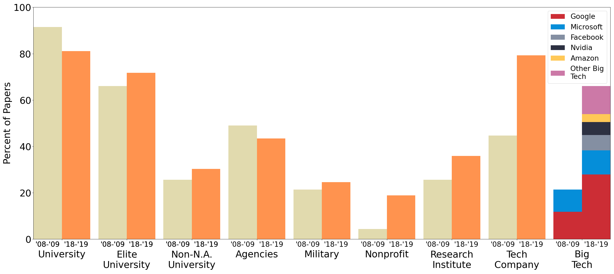
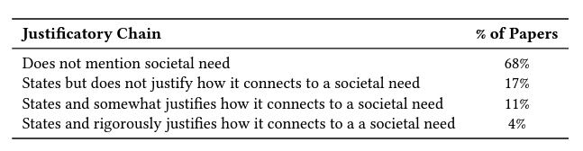

# Introduction
The growth in the size and domains of datasets and machine learning (ML) models makes it challenging to document them with complete transparency which questions their accountability. 
Transparency and clear documentation techniques will enable stakeholders and potential users to understand the datasets and their use cases without expertise in the field, and allow selection of ML models based on their intended use, performance and limitations. In this blog, we aim to introduce frameworks that improve documentations of datasets and ML models that are more transparent, accountable and easy-to-read.

## Motivations
Machine learning models have demonstrated sensitive and harmful social biases in reproducing and amplifying training data in recent research and experiments. However, the traceability of the problematic training data in this section has not been deeply discussed and studied in the machine learning community.

To investigate the issue of data traceability, the paper [Datasheets for Datasets](https://arxiv.org/pdf/1803.09010.pdf) proposes a standard for documenting the process of machine learning datasets to record the source, content, and purpose of data recall, to improve transparency and fairness. The main target group includes data memory creators and data users, and this method aims to promote data memory maintenance, remove sensitive information, and prevent leakage; For dataset users, it can help them have a better understanding of the data's situation and content before use, avoiding misuse.

With the increasing application of machine learning technologies, reports of errors and failures have surfaced, emphasizing the need for a framework that standardizes ethical practice and reporting. This framework would enable stakeholders to evaluate models not only on traditional metrics but also on ethical, inclusive, and fair considerations. The "Model Cards" concept aims to fill this gap by providing a standardized way to communicate the intended use, performance, and limitations of ML models, facilitating informed decision-making among developers, users, and regulators. Furthemore, the “Data Cards" concept aims to provide a method to make documentation of datasets more transparent and accountable for responsible AI systems, as well as enable tracking of AI systems trained on particular datasets. 

# Methods
[Datasheets for Datasets](https://arxiv.org/pdf/1803.09010.pdf) Using the Labeled Faces in the Wild and the Pang and Lee polarity datasets, the two datasets were tested by creating strength data tables. The test included whether the datasets contained unintentional, useless, harmful/unwanted biases to society. 

The creation of datasets involves several crucial aspects, including motivation, composition, collection process, preprocessing/cleaning/labeling, usage, distribution, and maintenance. However, not all questions related to these aspects apply universally across datasets, and irrelevant questions are typically omitted.

**Key Aspects Explored:**
- **Motivation:** Reasons behind dataset creation, transparency about funding sources, and considerations for specific tasks.
- **Composition:** Types of data within the dataset, relationships between data types, and connections to larger datasets. For datasets involving human data, questions address the identification of groups or individuals and the sensitivity of the information.
- **Collection Process:** Methods of data acquisition (direct or indirect), awareness and consent of individuals regarding data collection, tools used, personnel involved, payment mechanisms, timeframe of data collection, and ethical reviews conducted.
- **Preprocessing/Cleaning/Labeling:** Whether data was preprocessed, retention of raw data, and reproducibility of the preprocessing methods.
- **Usage:** Applications of the dataset, existing research outputs, potential future uses, and inappropriate fields of use.
- **Distribution:** Methods and timing of dataset availability, and terms of access.
- **Maintenance:** Responsible parties for maintenance, contact information, update frequency, and mechanisms for external contributions.

**Adoption and Challenges:**
Since its inception in March 2018, datasheets for datasets have gained recognition across various sectors. Academia and major tech companies like Microsoft, Google, and IBM have integrated datasheets into their workflows. Google has extended this concept to model cards for documenting AI models. IBM proposed fact sheets for AI services, detailing characteristics including dataset documentation.

Challenges persist, such as adapting these practices to fit organizational infrastructures and addressing issues with dynamic datasets. Datasheets, while helpful, are not a panacea for eliminating all societal biases or risks, as unforeseen uses and necessary demographic labels can complicate dataset application.

In contexts involving human-related data, interdisciplinary collaboration with experts in fields like anthropology and sociology is crucial to navigating the ethical complexities of data collection. This collaborative approach ensures respectful and informed data handling, influenced by diverse social, historical, and geographical factors.

[Data Cards: Purposeful and Transparent Dataset Documentation for Responsible AI](https://dl.acm.org/doi/pdf/10.1145/3531146.3533231) provided a framework to make documentation of data sets more open, transparent and accountable. In order to achieve this goal, the authors introduce Data Cards which document the critical information about the data set throughout its lifecycle.

**Principles of Data Cards**
- **Flexible**: It should be able to describe a wide range of datasets including datasets from single or multiple sources, static datasets and datasets with multiple modalities.
- **Modular**: Document meaningful information in a succinct, well-organized and self-contained manner to provide end-to-end description of each aspect of the dataset.
- **Accessible**: Should be formatted across multiple granularities to enable users to navigate through the detailed descriptions of the dataset.
- **Extensible**: Contents of the data card must be easily reconfigurable and extendable for novel datasets, analyses and platforms.
- **Content-agnostic**: Should be able to use various data representation methods such as multiple choice selections, long-form inputs, visualizations, images, code blocks and others.

The diagram below shows a Data Card template to better understand how data cards can be used to build more transparent and trackable dataset documentations for Responsible AI systems.

 

Furthermore, the authors were also able to categorize 31 themes that can describe any dataset. The figure below tabulates these 31 themes.

The authors also propose OFTEn, a consistent and repeatable approach to identify and add new themes from dataset life cycles in a Data Card that are reportable by everyone in the organization. OFTEn considers the agents’ use of the dataset as a distinct stage, enabling feedback from the downstream stakeholders. This enables tracking of AI systems trained on such datasets as well as increases our understanding about the caveats and assumptions that potential agents should be aware of.

 

An example of OFTEn framework used as a generative tool for data consent across a datasets’ life cycle.

 

The [Model Cards for Model Reporting](https://arxiv.org/pdf/1810.03993.pdf) outlines a detailed structure for what a model card should contain, including:
- **Model Details:** Basic information about the model such as developers, version, type, and intended use.
- **Intended Use:** Clear articulation of the model's intended applications and potential out-of-scope uses.
- **Factors:** Identification of relevant factors (demographic groups, environmental conditions, etc.) that could affect model performance.
- **Metrics:** Description of the metrics used to evaluate the model, including performance measures and decision thresholds.
- **Evaluation Data:** Details on the datasets used for model evaluation.
- **Training Data:** Information on the data used to train the model, when available.
- **Quantitative Analyses:** Disaggregated evaluation results showing model performance across different groups and conditions.
- **Ethical Considerations and Caveats:** Discussion of any ethical issues, potential risks, and any other concerns or recommendations.

The authors of [The Values Encoded in Machine Learning Research](https://arxiv.org/abs/2106.15590) conduct a manual analysis of 100 of the most highly-cited machine learning research papers from 2008-09 and 2018-19 focusing on the abstract, introduction, discussion, and conclusion sections of each paper. All of the papers they looked at had been accepted by the top tier NeurIPS and ICML conferences as a first measure of importance and the “most highly-cited" factor solidifies the perceived importance of the papers selected. They also investigated papers across the two different time periods a decade apart to avoid any short lived trends. Their novel annotation scheme they created and carried out to analyze each paper used the following steps:

- Examine the “justificatory chain" of reasoning by which the paper justifies its contributions
- Closely read each of the abstract, introduction, discussion, and conclusion sections to identify perceived values being portrayed
- Identify the extent to which the paper discusses potential negative impacts
- Document and categorize the author affiliations and funding sources

Following these steps helps paint an elegant picture of the true motivations behind each individual piece of research that usually tends to follow patterns similar to those of other ML research works. Establishing reliability is emphasized through the employment of a diverse research team who is said to have followed qualitative research best practices.

# Key Findings
The [Model Cards for Model Reporting](https://arxiv.org/pdf/1810.03993.pdf) presents two example model cards: one for a smiling detection model and another for a toxicity detection model. These examples demonstrate how model cards can highlight performance disparities across different demographic groups, thereby underscoring the importance of transparent reporting for identifying and mitigating biases.

[The Values Encoded in Machine Learning Research](https://arxiv.org/abs/2106.15590) presents a survey of popular machine learning research works to illustrate common values found across the overarching ML research domain.
The figure below shows the breakdown of values identified in each of the 100 research papers analyzed. The vast majority of papers were found to focus on factors like performance and efficiency, whereas user rights and ethical principles were rarely considered. The authors attribute some of this to the pressure and political climate behind having a paper accepted by a leading conference with limited room to capture your audience’s attention.

The image below shows the breakdown of paper affiliations with big tech companies and other corporate entities across two time periods from 2008-09 and 2018-19. It is clear that these affiliations are becoming more and more common with the potential to truly shape the agenda of the research being conducted. Funding from these sources has the potential to skew the reliability of work and especially the values being portrayed.

Ties in research to big tech are becoming more and more common. It is said that “the influence of powerful players in ML research is consistent with field-wide value commitments that centralize power." This means that research funded by large corporations often perpetuates the goals of those behind the funding, for better or worse.

Finally, the image below shows the breakdown of the so-called justificatory-chain of research which illustrates the vast lack of care for considering the potential for negative impact within research.

Papers are said to often try to portray themselves as appealing to the needs of the overall machine learning research community while the societal benefits or drawbacks of the work within the greater context are often ignored. There is little discussion of ethics across the board with an emphasis on performance instead.

# Critical Analysis

[Data Cards: Purposeful and Transparent Dataset Documentation for Responsible AI](https://dl.acm.org/doi/pdf/10.1145/3531146.3533231) creates a novel innovation in the structure and documentation of dataset. Its use of user-centric design and detailed case studies illustrate a dedication to ensuring the Data Cards system is open, accessible, and transparent for wide adoption. Having a systematic framework helps in capturing the nuanced information for each dataset in a way that can be well understood. The system has some competing pressures that show the possible downsides. For example, the implementation of Data Cards could be quite complex which limits smaller organizations while at the same time being scalable in real-world scenarios requires that it be capable to handle diverse environments with unforeseen requirements. The paper displays a significant level of technical expertise but could have been aided with more input from non-technical stakeholders to increase inclusivity. This leads into the potential biases of the paper such as expertise bias, with the framework being designed by and for those with higher data literacy. The case studies could also be affected by some degree of selection and survivorship bias where the studies showing successful Data Cards may have been produced or collected for that very reason. The primary ethical consideration for a system documenting the potentially delicate information about a dataset’s origin and processing is the privacy and security concerns, where the data of any individual impacted must be closely guarded. The main benefit of Data Cards is the enhanced accountability for dataset creation and use.

[Model Cards for Model Reporting](https://arxiv.org/pdf/1810.03993.pdf) said that model cards are a step in the right direction to make machine learning practices more ethical, transparent and accountable. They standardize model documentation allowing stakeholders to make informed decisions and compare different models. The extent to which fairness and transparency can be fostered by model cards also depends on the level of integrity as well as how thorough the information provided by the developers is. Though they may be useful for pointing out disparities in performance, issues such as these will have to be addressed via collective efforts in both model development and dataset curation processes too.

[The Values Encoded in Machine Learning Research](https://arxiv.org/abs/2106.15590) paper explores the motivations and values behind the most highly-cited machine learning research across two time periods a decade apart. The line of inquiry takes a step back from the dominant ML research themes of accuracy and performance to provide a reflective look into the agendas of 100 of the foremost ML research works. The authors conduct a manual analysis of each of the papers’ abstract, introduction, discussion, and conclusion sections utilizing a novel annotation scheme they have created. This analysis identified 59 different significant values they found to be prominent across mainstream machine learning research. These values are gathered systematically and presented formally alongside other important ethical and motivating factors to include the mention of negative potential, or lack thereof, and source of funding or other affiliation relationships.

Perhaps the foremost strength of this paper is the novelty of the approach it takes with the idea behind it in the first place. As seen in the most dominant values found by the research, the vast majority of ML research is focused very heavily on performance and generalization with a higher degree of funding from big tech companies that can easily taint the intrinsic reputation and motivation of research. This research serves as a call to action in that it helps bring attention to the lack of ethical considerations across many popular research works. Hopefully future research will do a better job of taking these ethical considerations into account when framing the values embedded within their research. The depth of analysis is also a very clear strength in that the researchers created an effective framework for analyzing research values with painstaking focus and passion. Their annotation scheme will serve as a wonderful basis for future work in the same domain and hopefully help make for more ethically sound research as the future of ML continues to evolve as one of the most dominant computing fields.

On the other hand, the nature of the investigations conducted manually by various individuals of different backgrounds could be perceived as both a strength and a weakness. The paper cites the diversity of those carrying out the analyses as a strength since it allows for each other's contributions to complement each other well, but this also seems like it introduces the potential for lots of bias since some of the conclusions drawn based on textual analysis are potentially quite subjective. They establish that they follow qualitative research best practices to do the best they can to avoid introducing bias into their research, but it seems impossible to avoid bias given that their investigations are driven by manual analysis.

The [Datasheets for Datasets](https://arxiv.org/pdf/1803.09010.pdf) article proposes a process for documenting a dataset. By evaluating and explaining various aspects of the dataset itself, it can help the creator of the dataset to think about and process the security of the dataset before it is published, which can to some extent avoid the leakage of sensitive information and privacy. And it can help users of the dataset to have a clearer understanding of all aspects of the dataset's content before use, helping them avoid the possibility of data abuse.
This process temporarily excludes legal issues in various fields, which requires more relevant experts to participate and is necessary. While enhancing the avoidance of data abuse, it increases the cost of dataset creation and use. In areas where relevant laws may be relatively vague, it may hinder the publication of datasets. In addition, many issues and ethical reviews further increase the technical cost of dataset creation, which can also hinder the publication and use of datasets.
