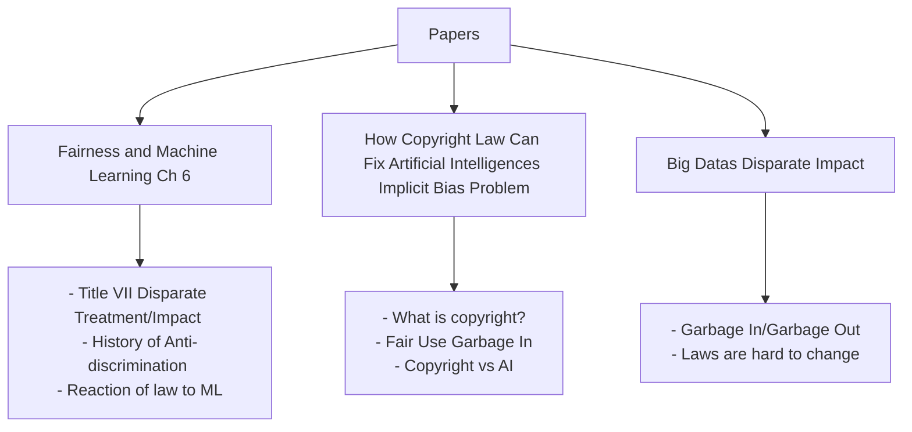

# Introduction (Fairness - Policy Aspects)

<!-- Summarize the main idea of the blog here - write this part last -->

Discrimination and proving the existence of discrimination have always been a difficult legal problem throughout American history. From the Civil Rights Movements, to Women's Rights, to LGBTQ rights, and now to complicated issues that are plaguing datasets in Machine Learning, counteracting these biases and unfairness through law has always been and remains to be an extremely important pursuit. This blog will review the [History of such laws](#motivations) including Anti-discrimination and copyright, explain what [methods](#methods) have been taken to counteract these issues, [key examples](#key-findings) of biases and unfairness, and finally a [critical analysis](#critical-analysis) of where and how society should progress from here. For definitions of important terms please refer to the [Appendix](#appendix) and for further research see the [References](#references) page.

## Motivations
<!-- Background information -->

Anti-discrimination has a complicated history in American law. It started with the Civil Rights Movement reacting to what were called "Jim Crow Laws" and the disenfranchisement of freed black americans. In order to fight this segregation and gain the rights they deserve, black americans did sit ins, practiced Civil Disobedience, and fought to be seen as equal. Anti-discrimination laws grew as a reaction to these protests. Title VII, a law establishing the legality of disparate treatment and disparate impact and how/when individuals can sue because of it, is a crutial law in the fight for equality and fairness. The fight for equal rights continued with Gender Discrimination, LGBTQ+IA Rights and Anti-discrimination, and Disabled Person's Rights, as well, growing the laws and adding more statutes to cover the inclusion of the groups.

### What is Title 7?

In America discrimination against protected classes (race, gender, religion, disability, sexual orientation, etc...) and not performing certain tasks because an individual is in those classes is unlawful. However, the internet and technology makes these issues even more complicated. The regulation of content online as well as the discrimination of Machine Learning algorithms can cause difficulties in the interpretations of the laws and the need for further development of verbage in the laws, as shown in the following YouTube video:

#### Disparate Treatment vs Disparate Impact

Disparate Treatment is when you finish the sentence "What action would have been taken if they were not [some protected class]?". This involves all cases where individuals were denied service because of being members of a certain protected group. Disparate Impact is when there is a disproportionate difference between groups of people. This can include unfair compensation, injustice, and more vague concepts. This means that historically disparate treatment is the easier concept to create laws for and prosecute individuals for because it is more "cut and dry" in the law. However, with the emergence of AI and, specifically, dataset related issues disparate impact has become more of a practical tool for fighting discrimination. When datasets have hidden distributions that hurt a certain class, a model causes unfair bias against specific groups, or apps do not explain which attributes are being used to identify users ads they receive this is a call for a disparate impact related discrimination case. The problems in AI are much more subtle in regards to fairness and anti-discrimination and in order to fight it the law needs to be more subtle and nuanced as well.

### What is Copyright and Fair Use?

The historical impact of discrimination is not only a problem in the continuance of historical trauma and pain but can also be perpetuated further due to toxic datasets and institutionalized bias. Datasets are a huge contributor to institutionalized bias and by training models on tainted datasets developers are ignoring the disparate impact that these models could be causing. The use of "good" datasets that are free of historical bias is limited by laws like Copyright Law and Fair Use and according to Levendowski on _How Copyright Law Can Fix Artificial Intelligence's Implicit Bias Problem_, “How to link to other materials: Law affects who can develop AI system and how to develop, including computer fraud and abuse act(CFAA) and trade secret, But the law that has the most influence: copyright law”. 

Levendowski further explains that fair use is decided case by case and a combination of the four factors:

>1. The purpose and character of the use; 
>1. The nature of the copyrighted work; 
>1. The amount and substantiality of the portion used in relation to the copyrighted work as a whole; 
>1. The effect of the use upon the potential market for or value of the copyrighted work.

Fairer AI may require the use of fair use data due to complications in the copyright law dictating who can use what data when. Datasets will need to be balanced out in order to correct for biases and minimize the effects of biases in the model. Creating Fairer AI may involve including copyrighted works, so that the dataset is larger and the effects of the bias are smaller.

To discuss if AI training data is in the conflict of the interest of the copyrighted work owners, “copy” should be defined first. According to Copyright Act, “copies” are “material objects [...] in which a work is fixed by any method now known or later developed, and from which the work can be perceived, reproduced, or otherwise communicated, either directly or with the aid of a machine or device". This definition of "copies" in the Copyright law can create complications in the interpretation of the law and will prove to clash with Artificial Intelligence, data mining, and models needing data to be trained on.

### Data Mining Is A Double Edged Sword

When considering society and stakeholders, data mining is a double-edged sword. From one angle, big data has revolutionized many industries through enabling activities such as optimizing delivery routes, mining prescription side effects, and studying human interactions. Additional advocates of data mining suggest that it can result in a reduction of discrimination by limiting the opportunity for individual bias to impact important assessments and requiring reliable empirical foundations on which decisions must be based. From the other angle, the outcomes of data mining are dependent on the quality of the data the algorithms are training on, or as the common adage goes, “garbage in, garbage out”. However, in the context of data mining, an often insidious result is discriminatory outcomes, whether reflective of historically prejudiced patterns in society and its institutions, prejudices of prior decision makers, or more nefarious (but much less prevalent) intent such as developer use of proxy variables for protected classes. The methods at which we choose to collect and modify datasets is important in the realm of fair models and responsible AI use.

# Methods

<!-- How? Specific laws -->

## Explainability

## Copyright vs AI (Garbage In/Garbage Out)

Though explainability is a good start to policing use of AI and the datasets it uses copyright law can affect the development of fairer AI systems as well. This is seen through processes including: Reverse Engineering, Restricting accountability, and limiting competition. We will now explore these three aspects of the intersection between copyright law and AI.

First, to reverse engineering, normally one needs to understand how the original code works, it would mean that there is a “copy” stored somewhere for the purpose of studying. By doing so the reverse engineer violates the copyright law. Most of the time, this act is pushed by a big company in a monopoly market for the maximization of the interest, the cost of reverse engineering is thus high for an individual or smaller competitors. This has the consequence of scaring away independent researchers, journalists, and the like because they do not want to deal with the complicated legal battles. By instantiating copyright in this area big companies and monopolies are doing just that, they are monopolizing the market and limiting the evaluation of their models and products and may be furthering the discrimination, known or unknown, in their models.

Next, accountability can usually be held up by three main ways: journalistic reporting, whistleblowers and crowdsourcing audits. Copyright law restrains all three. to make a report piece, which is normally published publicly, a part of the dataset will be revealed to the public, which can be considered infringement, similarly, for a whistleblower to report something, they will need to possess a copy of the data. Thus copyright law actually discourage other parties to hold the AI system developers accountable. By restricting the accountability of companies and their developers the makers of the models may become negligent and may take no steps to guarding against implicit bias in the data and counteracting these biases for the end users.

Finally, training a big model needs a plethora pile of data, the data used for building large AI systems is gained by building or buying. This means that resources are more accessible for big tech companies, who either have a long history of being in the Internet playfield or have enough wealth to fund such acts. This limits the market so that other smaller developers cannot enter the market to make better less biased models. With no incentive of competition the big companies are not motivated to create better models with their data and will continue to perpetuate the issues and implicit bias found in their datasets.

### Laws and Data are Hard to Change

While discrimination in data mining is in and of itself difficult to root out, it poses additional challenges when viewed from a legal lens of trying to reduce discriminatory outcomes. Title VII, which prohibits discrimination in employment, and copyright law have been looked at as tools for anti-discrimination and rooting out the inherent issues found in datasets.

To abide by copyright laws, the developers are driven to use public domain works and Creative Commons-licensed works, however these works would embed bias. For Public domain bias most of the datasets are as old as 1923 and, thus, reflect a “wealthier, whiter, and more Western” view on society. They do not include the more inclusive aspect of the society today and will have biases that favor a very specific demographic. This can lead to existing issues being furthered and unresolved because the model is mimicking historical human behavior. The next version is CC-licensed datasets. CC-license allows creators to license their “works freely for certain uses, on certain conditions". That sounds like a good option for a solution to copyrighted datasets, however, a simple example can show otherwise. One of the most significant CC-licensed datasets is wikipedia, however only 8.5% of the editors were women in 2011, showing a clear gender bias in the data. So even with free to use data always seems to have a bias one way or another.

# Key Findings

<!-- What? Specific examples -->

## Importance of Explainability

<!-- ### Explainability: Completeness and Correctness -->

One of the biggest examples of a company that uses AI models to target their users is Facebook. Facebook has counteracted bad publicity of their targetted ads by adding a "Why Am I Seeing This?" button on each of the ads. This button will show a vaguely written explanation that is meant to make the user placated and feel like they are in control. However, it has been shown that if Facebook wanted to, they could give a much better explanation for their ads and specifically what attributes were used to predict the users wants and needs. The following is a Case Study on Facebook's Ad Transparency from the Network and Distributed System Security Symposium in 2018: 

By leaving out key information Facebook is able to shield themselves from users knowing what data is being collected. They are able to stay within legal boundaries, providing just enough of an explanation to their users on what attributes they are using and selling to advertisers. This is a blatant disregard for the explainability of the system and could be fixed through the updating and growing of laws to meet the needs of explainable AI.

## Encouraging fair use

Counteracting discrimination in models can be done in two ways by fixing the datasets themselves and by having better datasets available. Instead of copyright, fair use should be encouraged.

In order to explore why fair use of data should be considered we must first explore why using copyright protected works is beneficial to the interest of the copyright owners and why it may be harmful. First, AI systems that use the data are inherently highly transformative. This means that they use the data in a different way and for a different reason, meaning it is a new creation. These AI systems produce new knowledge and contribute to society. Additionally, training is a “nonexpressive use”, meaning it is fair use to use copyrighted works for training AI systems and it is beneficial to society. 

Second, AI models are factual in nature. Researchers of this topic argue that AI is learning the concepts and the facts of the works but not the “creative component”. Infringement is when one party uses a part of the originial work to try to connect with the audience dishonestly and it is not the case for AI training. However, some believe that if a model is just using the facts of the data it means it does not infringe on the copyright of the data it used. This means that the data should be fair use. Furthermore, it is not fair use if it "may serve as a market substitute for the original". This is not the case for AI training as the product is not the data itself but a model. Apart from that if fair use is widely adopted, there will not be a licensing market as it would still be favorable to big tech companies.

## Limited Liability Under Title VII In Most Cases
Title VII poses several challenges with respect to trying to reduce discriminatory outcomes from data mining. Most notably, liability for discrimination from data mining would be difficult due to  the common situation of not having discriminatory intent, or “disparate intent”. For example, if the data reflects historical patterns of prejudice, if there is no intention to harm, Title VII may hold that data mining is a justifiable business necessity if the outcome is predictive of future employment outcomes. From a technical aspect as well, every step in the data mining process (defining target variable, labeling and collecting training data, using feature selection, making decisions on the basis of the resulting model) could potentially result in discriminatory outcomes for protected classes, so identifying intent somewhere in the pipeline would be a formidable challenge. Rather, under Title VII, potential triggers of liability would include “disparate impact” (discriminatory effects without intent), or “disparate treatment” (data mining systems treat everyone differently). Another solution, however, rather than relying solely on the letter of the law and enforcement agencies, rests on the employers themselves through means such as education. For example, employers may not be aware of the technological underpinnings of data mining and the potential for discrimination.

## Government Reaction

There are many ways for the Government to rise to the occation and fight injustices in algorithms. Some options are that they could make new laws, they could change the old laws to better fit the new technological age, and they could create organizations to fight and audit the creation of disruptive and discriminatory AIs. In this section we will show the key findings of how the government has reacted to AI so far.

### Federal Trade Commission

The Federal Trade Commission (FTC) is meant to be an organization that regulates products and has been used in the past to regulate discrimination in products. Title VII had no power until 1972 when it was enforced by the Department of Labor and the FTC. The power of these organizations has waxed and waned over the years and its impact on society and business as a whole has varied.

There is an argument that the FTC should monitor data because their concern is all about consumer protection. For example, when face lock does not work for certain types of people the FTC should have the power to make the use of products fair for all consumers. The FTC should be able to “[...] look to 'established public policiesp' in determining what is unfair. It has been suggested that the FTC can thus look to antidiscrimination statutes and rules as scaffolding to build a framework for making determinations about algorithmic discrimination”[[20]](#references). The FTC is in charge of making policies for the protection of the consumers they can make it so that there are rules to be followed by the creators of AI models. They are also in change of transparency and protecting against deceptive practices. This means that the FTC could take steps to punish companies that are training models in a certain way that causes to end result to not work for certain users, thus resulting in false advertising of the product and a bad consumer experience.

### Algorithmic Impact Assessments (AIAs)

Similar to the FTC Algorithmic Impact Assessments (AIAs) have been suggested in the US but none have been implemented as of yet. These assessments are meant to assess the impact of the product, how it was created, and how it will be used. This is an analysis of the AI model that will be done by a third party expert who will audit and give a grade on the product's bias or lack there of. These are types of regulatory audits that review the bias, algorithm, and impact of the product. By adding these assessments companies will not only be encouraged to do their due diligence when designing the algorithm but the assessments will also catch any products that are discriminatory before they enter the market.

The argument against AIAs is that they may be ineffective if companies can choose their own auditors or lobby the government to receive breaks on their audits. However, government audits for technology (not spoecifically AI) are performed on DoD contractors and companies today. These standards are strict and when a company does not follow the rules they are at risk of losing current and future contracts if the problem is not solved. When facing strict risks such as these most companies will be sure to follow the laws and create better systems for their users.

### Evaluating for Copyright

To examine the system some part of the work should be available, and the work should not be perceived as expressive work but only to identify bias. With the strict definition like this, it should be assumed that the parties who are examining the AI system will not be viewing the work as an expressive work but as an informative work.

# Critical Analysis

<!-- What are your opinions? Where do we go from here? -->

### Critique and analysis of Law making in discrimination:

It is a controversial topic, as the copyright law protects the interest of the copyright owners, and it seems that by encouraging fair use, the interest of the copyright owners will be harmed. However, like open source software, in my opinion, in an environemnt where the resources are opener to everyone, there would be more accountability, more competition and less black boxes, and I believe the society as a whole will benefit from it and it would open up more doors for the researchers and parties with smaller resources to contribute to the research.

Much like how the law can lag behind social issues, the same can be true for technologies. This is especially true when it is social issues related to technology. As technologies emerge, policy makers may not have enough expertise to easily evaluate new technology to make or analyze laws based on them. AI is one such field as there have not been many policies made regarding it yet. Not all the blame lies on the policy makers however, as emergent technologies can change rapidly so it may be wise to give some time to “settle” before making policies. Besides that, the issues faced with making policies on AI provide new and complex challenges that have not been handled before. While human discrimination can be more easily defined, it may be more difficult to detect depending on how interpretable the AI is. The issue of who is responsible is also a big one as who is responsible; the creator, the company, maintenance, the AI, or someone else?

While it can be difficult to define, here is a possible idea relating to the unique problems of AI. Once standards of required fairness, bias, and discrimination are created, a new agency and or job could be created. The job would be like a pen tester, but for AI. How strict the AI is tested would be based on the risk of the AI. The AI abuse tester would be knowledgeable on AI bias and would be given access to an AI to do comprehensive testing and make a AI responsibility report similar to how a penetration tester makes one after their test. If the AI meets the standards for the level of risk it is assigned, it would be allowed to be put in use. If not the company will have to make some adjustments before rolling the AI out.

While the separation of powers into the three branches of government has had the benefit of mitigating one side becoming too powerful, the downside is sometimes a loss of efficiency when creating new laws. This can be due to several reasons. The executive can veto any bill that is passed in the legislative. Partisanship between political parties in which the issue is one that a party does not care for. Parties can also deny bills to strong arm the other party to pass something of theirs. Riders, small laws that are snuck in with bigger ones can prevent a bill from going through, as while the main part may be agreeable, the other side may not want the rider portion to come through. The federal executive does not have the power to line veto, which is removing parts of a bill while passing the rest. Line veto is allowed in ~44 states for governors, but is not allowed for the executive. While it can make it more efficient and prevent undesirable riders, it would make the executive extremely more powerful. A law could be given to the executive and they could butcher it to have none of what it was meant to be. Law tends to lag behind the social issues, but as demonstrated there is a lot of it comes from the overall uncertainty and possible slowdowns of making laws. 

# Appendix

| Term | Definition |
|--|--|
| Copies | “material objects [...] in which a work is fixed by any method now known or later developed, and from which the work can be perceived, reproduced, or otherwise communicated, either directly or with the aid of a machine or device" |
| Fair Use | | Allows limited usage of copyrighted material without paying for a license | 
| Disparate Impact | | Practices in employment, housing, and other areas that adversely affect one group of people of a protected characteristic more than another|
| Disparate Treatment | | Practices in typically employment that disproportionately effect one group that is protected |
| Institutionalized Bias | | Biases that have become ingrained in either the law itself or in the procedures and culture of an institution |
| Stakeholders | |An entity that has a vested interest in the outcome of the partcular subject or matter|
| Transformative Use | "Must be productive and must employ the quoted matter in a different manner or for a different purpose from the original ... if the quoted matter is used as raw material, transformed in the creation of ... new insights and understandings—this is the very type of activity that the fair use doctrine intends to protect for the enrichment of society" |

# References
Barocas, Solon and Selbst, Andrew D., Big Data's Disparate Impact (2016). 104 California Law Review 671 (2016), Available at SSRN: https://ssrn.com/abstract=2477899 or http://dx.doi.org/10.2139/ssrn.2477899

I.O., Gallegos et al. Understanding United States Anti-Discrimination Law, 2023, fairmlbook.org/legal.html. 

Levendowski, Amanda, How Copyright Law Can Fix Artificial Intelligence's Implicit Bias Problem (July 24, 2017). 93 Wash. L. Rev. 579 (2018), Available at SSRN: https://ssrn.com/abstract=3024938
