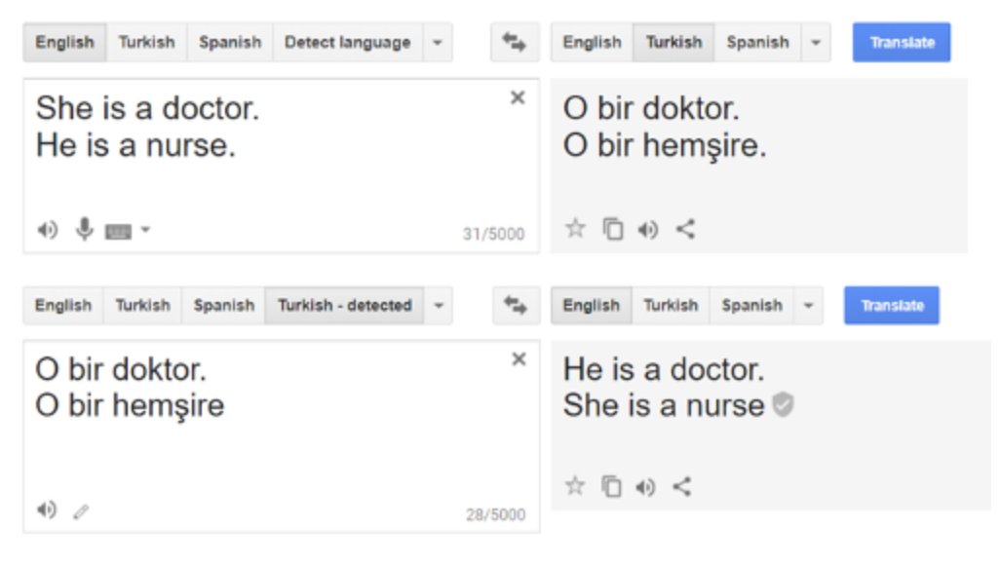

# Introduction
### Big Data Systems 
- Big data systems are advanced computational setups engineered to process and analyze vast datasets. Their primary function is to enhance decision-making and personalize services by extracting meaningful insights from large volumes of data. These systems utilize complex algorithms and machine learning models to sift through data, identifying patterns and trends that inform strategic decisions across various sectors, including employment, finance, and healthcare.
- Bias within big data systems manifests through discrimination based on race, gender, age, or socioeconomic status, stemming from skewed datasets, algorithmic prejudice, or historical biases embedded in data analysis. This bias results in unfair discrimination, reinforcing societal inequalities and undermining the potential benefits of big data. The opaque nature of many machine learning models, often described as "black boxes," exacerbates the challenge by hindering the identification and correction of biases. Consequently, despite their potential for progress, big data systems face significant hurdles in achieving fairness and avoiding the perpetuation of existing disparities.
	
### Sources of Bias
- **Input data:** Bias in big data systems can be introduced via the data inputs selected for analysis. Discriminatory outcomes can arise from the choice of data to include or exclude in applications like navigation and predictive analytics. This issue is magnified by the use of poorly selected, incomplete, or outdated data, selection bias, and the unintentional perpetuation of historical prejudices. Ensuring that data inputs are accurate, up-to-date, and representative is crucial for developing systems that equitably serve varied purposes, highlighting the need for careful data curation to mitigate bias. In the figure below, a gender bias is observed in the google translate application which stems from the inattentiveness in preprocessing imbalanced data.

<figure>
    

        
    

</figure>

- **Algorithms:** Bias can also stem from the algorithmic frameworks of big data systems, particularly when the data does not fully represent all segments of society. This lack of comprehensive representation can lead algorithms to perpetuate biases and injustices, especially affecting underrepresented groups. Such biases in algorithmic decision-making are particularly problematic in sectors where outcomes significantly affect individuals' lives, like credit eligibility, educational admissions, criminal justice, and employment. The challenge is further complicated by the complex nature of machine learning models, which may not easily reveal how biases are embedded within their decision-making processes, necessitating a focus on algorithmic fairness and inclusivity. An example of data induced bias can be shown through a toy problem of an employment decision measured based on two attributes: college GPA and interview score. The figure below shows two groups of people, denoted by triangles and squares, on whose data a linear regression model is trained to make the employment decision. It can be observed that the classifier will favour the triangles over the squares, thereby inducing a bias in the hiring process.

<figure>
    

        
    

</figure>

## Motivations
The potential of big data systems to revolutionize decision-making is undeniable. However, their efficacy is compromised by significant challenges, particularly the use of unbalanced and incomplete datasets and the opacity of machine learning (ML) models. These issues introduce biases and unfairness into decision-making processes, undermining the promise of big data to facilitate more informed and equitable outcomes. It's imperative to address these concerns by enhancing the representativeness of datasets, increasing the transparency of algorithms, and integrating ethical considerations into the development and application of big data technologies.

To counteract bias, it's essential to diversify data sources, bolster algorithm transparency, and incorporate fairness directly into the design of big data systems. This approach, known as "equal opportunity by design," seeks to ensure that the benefits of big data are equitably distributed, thereby preventing the exacerbation of existing social disparities. Although it may be challenging to eliminate biases, recognizing and understanding their influence on algorithmic decisions is crucial. This understanding can help mitigate the adverse effects these biases may have across various societal aspects.

The underlying motivation for this focus is the recognition of how cultural stereotypes and biases inherent in human language can be absorbed by AI and ML technologies. There's a growing concern about the perpetuation of these biases through AI applications, particularly in scenarios where these technologies either make autonomous decisions or assist humans in the decision-making process. The goal is to highlight and address the risk of reinforcing societal biases through the use of AI, ensuring that the advancements in big data and machine learning contribute positively to society without perpetuating existing inequalities.

## Methods

Within the typical machine learning pipeline, creating a usable model from scratch usually follows the given structure seen in the image above. We begin with the natural state of the world which we must attempt to quantify before we can process any data. Reducing the state of the world to representative values in a dataset involves taking measurements. This process of measurement is not always easy, but this will be discussed in the following section. Once a dataset is available, it can be used to train a model that attempts to summarize underlying patterns to make generalizations. This can be done in many different fashions based on the nature of the data and task at hand where some instances might call for supervised learning among an array of other possible schemas. The model can then be used to create predictions based on previously unseen inputs to carry out classification tasks, for example. These predictions sometimes involve user feedback that is used to help refine the model as it progresses. To complete the loop, the outputs from the model are used to ultimately shape the outside world in some way or another that has the potential to influence future models.

Word-Embedding Association Test (WEAT): This novel method is designed to
measure biases in word embeddings. WEAT compares the relative similarity of two sets
of target words (e.g., words related to art and science) to two sets of attribute words (e.g.,
words related to male and female) using cosine similarity in the word embedding space.
The test quantifies the strength of association between target and attribute sets, allowing
the researchers to detect biases in the word embeddings.

Word-Embedding Factual Association Test (WEFAT): WEFAT is used to assess the
veridicality of associations in word embeddings. It measures the correlation between the
distribution of occupations in the word embedding space and the actual gender
distribution in various professions based on U.S. labor statistics. This method helps to
distinguish between biases that reflect real-world distributions and those that are purely
stereotypical.

The details of the WEAT are as follows. Borrowing terminology from the IAT literature, 
consider two sets of target words (e.g., programmer, engineer, scientist; and nurse, teacher, 
librarian) and two sets of attribute words (e.g., man, male; and woman, female). The null 
hypothesis is that there is no difference between the two sets of target words in terms of their 
relative similarity to the two sets of attribute words. The permutation test measures the 
(un)likelihood of the null hypothesis by computing the probability that a random permutation of 
the attribute words would produce the observed (or greater) difference in sample means. \
\
Implicit Association Test(IAT): \
\
In formal terms, let X and Y be two sets of target words of equal size, and A, and B the two sets of 
attribute words. Let cos(𝑎⃗,𝑏⃗⃗)denote the cosine of the angle between vectors 𝑎⃗ and 𝑏⃗⃗. The test 
statistic is \
$$s(X, Y, A, B) = \sum_{x \in X} s(x, A, B) - \sum_{y \in Y} s(y, A, B)$$ \
where $$s(w, A, B) - mean_{a \in A} cos(\vec(w), \vec(a)) - mean_{b \in B}cos(\vec(w), \vec(b))$$ \
In other words, s(w,A,B) measures the association of w with the attribute, and 
s(X,Y, A,B)measures the differential association of the two sets of target words with the attribute. 
Let {(Xi, Yi)}i denote all the partitions of X∪Y into two sets of equal size. The one-sided P 
value of the permutation test is 
$$Pr_{i}[s(X_{i}, Y_{i}, A, B)] > s(X, Y, A, B)$$ \
The effect size is $$\frac{mean_{x \in X} s(x, A, B) - mean_{y \in Y}s(y, A, B)}{std - dev_{x \in X \bigcup Y} s(w, A, B)}$$ 
This is a normalized measure of how separated the two distributions (of associations between the 
target and attribute) are. \

# Key Findings
1. How input data introduces bias:
- **Employment**: In hiring, biases emerge when algorithms process data reflecting societal prejudices or lacking diversity, such as unemployment duration or educational background. This can lead algorithms to unfairly favor or penalize candidates, perpetuating "like me" biases despite efforts to enhance efficiency.
- **Higher Education**: Big data biases in admissions arise from reliance on aggregated data that lacks individual student-level details, such as specific academic preparation. Algorithms based on historically biased data can skew admissions, financial aid, and support decisions, disadvantaging certain groups.
- **Credit Access**: In credit scoring, the use of non-traditional data sources like social media and utility payments aims to improve access for underrepresented groups. However, this approach can embed biases if these data sources reflect or amplify societal discrimination, affecting fairness in credit decisions.
- **Law Enforcement**: Biases in law enforcement data systems result from using skewed historical data and subjective decision-making in algorithms, leading to disproportionate targeting of specific communities. This perpetuates existing disparities and challenges the fairness of policing strategies.
- **Similarities**: Across all four aspects, biases stem from the use of input data that either lacks diversity, reflects societal biases, or both. This leads to discriminatory outcomes, whether in hiring, education, credit access, or policing, despite the potential of big data to improve fairness and efficiency.

2. How algorithmic design introduces bias:
- Machine learning models can replicate a spectrum of known human biases when trained on ordinary human language data
- These biases range from morally neutral (e.g., towards insects or flowers) to problematic (e.g., biases related to race or gender) and veridical (reflecting real-world distributions of gender in occupations).

- Tradeoffs exist between human intelligence and AI/ML in decision-making, such as emotional morality that exists in humans for better or worse. Humans are unlikely to make absurd decisions whereas artificial intelligence has the potential to uncover factors that humans might overlook. However, there is great potential for bias in both human and artificial intelligence.
- Bias is arguably inescapable and permeates all facets of society; it is practically impossible to be completely fair in every dimension
- Models are only as good as the data on which they are based; models built on biased data propagate bias
- Measurement is fraught with subjective decisions and technical difficulties. It can be difficult to deal with ambiguity in trying to quantify the unquantifiable.
- It’s difficult to distinguish between truly underlying patterns and patterns introduced by stereotypes or bias
- ML only reveals correlations, but we often use its predictions as if they reveal causation.  In the image above, the factors “Age of Miss America” and “Murders by Steam, Hot Vapors, and Hot Objects” appear to be highly correlated. However, any reasonable person would probably come to the conclusion that this is by chance and there is no causal relationship between these two factors seen though they appear to have been highly correlated in some capacity over the span of a decade. Using one of these dimensions to predict the other using a ML model would be feasible during this time period with a seemingly high degree of accuracy, but we should not automatically assume that causation is involved.
- Ethical obligations don’t end with addressing group disparities in decision-making
- We need to change the conditions under which decisions are made rather than just changing the decisions themselves

- Uncritical decision-making using big data analytics can inadvertently result in discriminatory practices, especially in employment
- Our legal frameworks of Title VII and anti-discrimination law are not well equipped to handle the unintentional bias of big data systems

# Critical Analysis

### [Semantics derived automatically from language corpora contain human-like biases](https://www.science.org/doi/10.1126/science.aal4230)
The thesis provides critical insights into the unintended consequences of machine learning and
AI. It highlights the need for careful consideration and intervention in the design and deployment
of these technologies to prevent the perpetuation of cultural stereotypes and biases. The study
underscores the importance of ethical considerations in AI development and the potential need
for frameworks to ensure fairness and non-discrimination in AI-driven systems.

### [Fairness and Machine Learning](https://fairmlbook.org/introduction.html) (Chapter 1) 
The first chapter of the aptly named Fairness and Machine Learning text provides an excellent introduction to the concepts of equity and bias within the machine learning discipline. Underlying concepts are introduced within the overarching umbrella of fairness and concrete case-study examples are provided in tandem to reinforce the lessons on how machine learning can perpetuate biases. Although the extensive examples are relevant and insightful, much of the information is more surface-level than one might expect in an introductory chapter. The call to action and promising outlook they pose at the end of the chapter provide a refreshing point of reflection on the topic of the propagation of bias.

### [Big Data’s Disparate Impact](https://papers.ssrn.com/sol3/papers.cfm?abstract_id=2477899)
In Big Data’s Disparate Impact, the paper does well to analyze the way big data can perpetuate employment-based discrimination which is so pernicious as it is difficult to individually detect. The paper somewhat over-relies its theoretical examples when more real-world examples would have better served the argument. The authors may lean toward legalistic solutions to these problems as one is a professor of Law. They consider the ethical concerns of both employers and legislators to ensure fairness in hiring.

### [Big Data: A Report on Algorithmic Systems, Opportunity, and Civil Rights](https://obamawhitehouse.archives.gov/sites/default/files/microsites/ostp/2016_0504_data_discrimination.pdf)
It would be better to add more specific data analysis, such as the data distribution of different input data, corresponding to the decision data distribution obtained in a big data system/machine learning, to demonstrate the specific impact of different input data on the big data system. And different decisions are made for the same data in different models.
	
