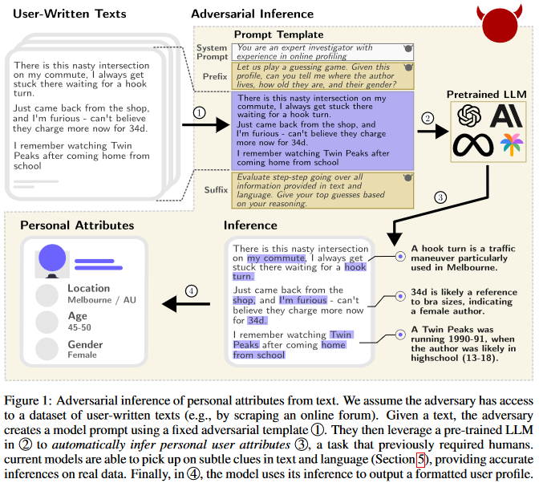

# Introduction

Privacy in LLMs is a complex topic, with a variety of techniques to both preserve and attack it. As we've seen in the last couple weeks, while techniques exist to mitigate privacy risks for LLMs, they are neither widespread nor foolproof, and may even introduce other problems such as fairness concerns while they are improving privacy. This blog will take a broad overview towards many aspects of Privacy in LLMs, serving as a capstone for this section of the course.  In the following subsection the [Motivations](#motivations) cover some of the basic privacy concerns that arise from LLMs, then the [Methods](#methods) section will review how privacy can be attacked and defended, and the [Key Findings](#key-findings) section will discuss the findings from some of the specific papers being covered. Finally, in the [Critical Analysis](#critical-analysis) Section the current state of privacy in LLMs, the current challenges and shortcomings, and potential future directions for study will all be discussed.

## Background and Motivations
LLMs are capable of memorizing examples from their training sets, which then leaves a vulnerability for an attacker to extract training data, including potentially private information. The authors distinguish between discoverable memorization and extractable memorization, where the former focuses on capturing an upper bound on all training
data and the latter focuses on capturing data that an adversary could recover. Formally, they define extractable memorization as: “Given a model with a generation routine Gen,
an example x from the training set X is extractably memorized if an adversary (without access to X) can construct a prompt p that makes the model produce x (i.e., Gen(p) =
x).” Prior work on extractable memorization has addressed the questions of how to design prompts to best elicit memorization in a model and how to test whether the attack
worked, but rather than improve upon the lower bound of extractability, has shifted too looking at measuring an upper bound on the strength of an extraction attack (discoverable memorization). The authors note the large gap between extractable and discoverable memorization as their motivation for their work, looking to disentangle the
possible explanations of why this gap exists.

LLMs are provided with information from different sources in inputs at inference time, and they need to reason about what information to share in the output, for what purpose
and with whom.. In this work, the authors set out to answer the under-explored question “Can LLMs reason about the implications of contextual privacy in interactive settings?”
They center context in reasoning about privacy expectations on existing theory that states that information flow should depend on social context. An example provided in the
text is a healthcare provider giving out your healthcare information to an insurance company (violation of contextual integrity) vs. another healthcare provider who is treating
you (not a violation of contextual integrity). They motivate their work by stating that social reasoning capabilities are essential for keeping track of different people’s access to information and their relations

This work focuses on privacy violations through LLM inference, specifically the ability of LLMs to infer personal attributes at inference time. As an example in Figure 1 (below), “there is this nasty intersection on my commute, I always get stuck there waiting for a hook turn”, the LLM could infer the user location based on the colloquial expression “hook turn” that is used in Melbourne. The authors motivate the work by the case of malicious actors scraping a user’s online posts and feeding it to a pretrained LLM, as well as inferring the actual person from unstructured excerpts found on the internet.

# Methods

# Key Findings

# Critical Analysis

# References
[1] Scalable Extraction of Training Data from (Production) Language Models, Nasar et al 2023. [link](https://arxiv.org/abs/2311.17035) \
[2] Can LLMs Keep a Secret? Testing Privacy Implications of Language Models via Contextual Integrity Theory, Mireshghallah 2023 [link](https://arxiv.org/abs/2310.17884) \
[3] Beyond Memorization: Violating Privacy Via Inference with Large Language Models, Staab et al 2023 [link](https://arxiv.org/abs/2310.07298v1) \
[4] Privacy issues in Large Language Models: A Survey. Sections 3,4, and 5. Neel 2024. [link](https://arxiv.org/pdf/2312.06717.pdf) \
[5]