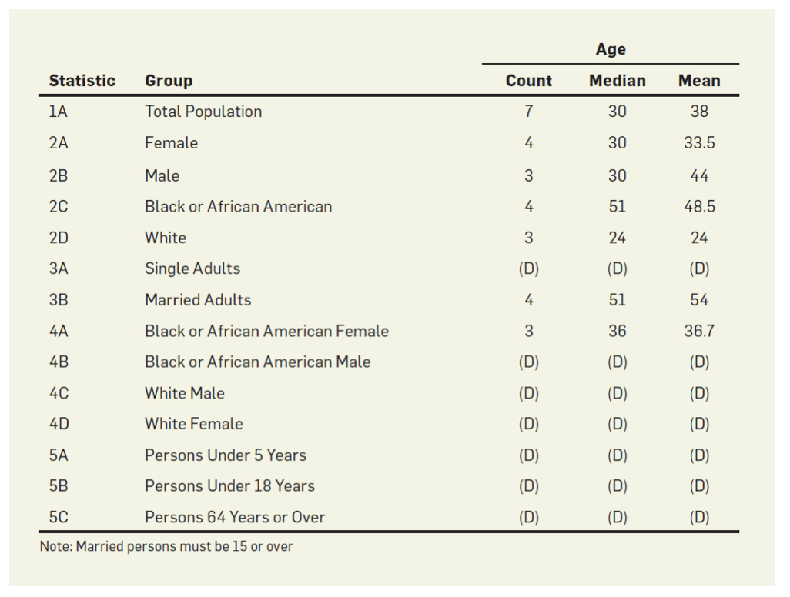
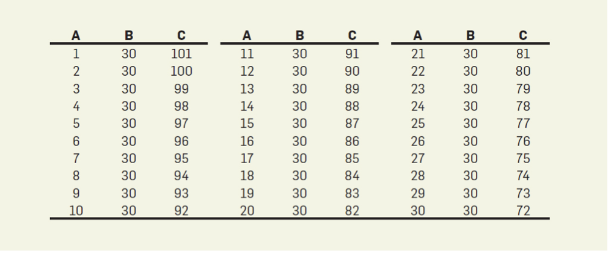

# Introduction
Differential privacy can be defined as a rigorous mathematical definition of privacy. An algorithm is said to be differentially private if the input to the algorithm does not affect the output. The need for differential privacy stems from the need for strong mathematical guarantees of privacy independent of heuristics, like anonymization, that have been proven to be suboptimal in various settings, especially linkage attacks.
In this blog, we will be discussing algorithms that are susceptible to information leakage as well as various differentially private algorithms.

## Motivations

Early works by [DN03](https://crypto.stanford.edu/seclab/sem-03-04/psd.pdf) can be considered as an preliminary stages of differential privacy. Dinur and Nissim were able to show how reconstructions attacks can work on data where noise is not added, as well as mentioned settings where the adversaries are computationaly-budgetted, setting where binomial noise is added to the data, and queries are restricted to particular classes, which is quite similar to the modern definition of differential privacy.  

Differential privacy is a very important concept in the fields of security and privacy. The basic assumption is that there are n individuals, each with their own data points, and the data points are sent to a trusted data manager, who publicly discloses the calculation results of the data through algorithm M. Under the processing of differential privacy, no individual data will have a significant impact on the results.  Differential privacy can effectively prevent various attack methods, including link attacks and reconstruction attacks. This is because even if an individual is added or removed from the dataset, the output change of the algorithm is very small, making it difficult for these attack strategies to be effective. Differential privacy does not prevent statistical analysis and machine learning of data. By making appropriate adjustments ε Value can find a balance between protecting individual privacy and maintaining the effectiveness of data analysis.

Perhaps one of the most notable examples of a case in which differential privacy is utterly important on a tremendous scale is the United States Census. Detailed personal data is collected on a mandatory basis for the entirety of the United States comprising over 300-million individuals, many intricately related to one another yet each with their own array of personal attributes. This data, once collected and aggregated, is then published publicly to varying degrees for many statistical purposes. The census results are used to apportion seats for the House of Representatives, to determine how to properly distribute federal funding, and more. Although there is a need for some of the aggregated statistical data to be publicly available, it is also extremely important to ensure the confidentiality of respondents closer to the individual level. Technological advancements are making it easier and easier to reverse engineer such datasets through database reconstruction attacks, so it is now more important than ever to understand what is possible with public data. As the authors of [Understanding Database Reconstruction Attacks on Public Data](https://ecommons.cornell.edu/items/046034b9-9365-436b-88aa-e8c3fae94b7c) write, “these attacks on statistical databases are no longer a theoretical danger.”

### Concepts and Definitions
This section describes the basic concepts related to differential privacy (DP) as well as the terminologies used in the DP literature.

#### Terminology
- **Neighboring dataset:** There is only a slight difference between the two datasets in terms of a small amount of data， $X \sim X_0$

- **Y:** the output space of algorithm M. More specifically, when we discuss an algorithm that maps a dataset from input space X to output space Y, Y is the set of all possible outputs that the algorithm can produce.

- **$\epsilon$**: It is a nonnegative parameter that represents the strength of privacy protection.

#### **$\epsilon$- (Pure) Differential Privacy**

If one algorithm satisfies all the neighboring datasets, $X$, and $X_0$ and all possible output subsets $\in$ Y, then 
$$\Pr[M(X) \in T] \leq e^\varepsilon \Pr[M(X_0) \in T]$$
The formula describes the degree of change in the output result of algorithm M when a dataset X undergoes minor changes (i.e. becomes a neighboring dataset)

- **$\Pr[M(X) \in T]$:** It represents the probability that the output result of algorithm M belongs to a specific set T when inputting the dataset X.

- **$\Pr[M(X_0) \in T]$:** This represents the probability that the output result of algorithm M belongs to the same specific set T when inputing the dataset $X_0$ (neighbor dataset).

#### **$L_1$-Sensitivity**

Given one function f, it will project a dataset to a real number vector. For any neighboring dataset $X$ and $X_0$, the $L_1$ sensitivity of f is defined as:
$$\Delta f = \max_{X,X'} \|f(X) - f(X')\|_1$$

$L_1$-sensitivity reflects how individual data change affects the results of queries. 

#### **Blatantly Non-private algorithms**

An algorithm is blatantly non-private if an adversary can construct a database $c \in \{0, 1\}^n$ such that it matches the true database d in all but o(n) entries.

# Methods

[DN03](https://crypto.stanford.edu/seclab/sem-03-04/psd.pdf) introduced a reconstruction attack to crack aggregation based privacy mechanisms and coined the concept of "blatantly non-private" algorithms. Dinur and Nissim considered a real-world setting and mimicked the Census data, where instead of individual records, block statistics are disclosed to preserve privacy of the citizens.

The above figure gives us the aggregate statistics to particular groups. If we consider statistic 2B, we can see there are 3 males with a median age of 30 and mean age of 44. Using this information, we can infer that one of the male's age (B) is 30 among the three males (A,B,C). Since we have the mean age, we can enumerate the 31 possibilites of the age combinations of A, B and C as shown in the figure below.

Using the similar heuristics, [Abowd19](https://twitter.com/john_abowd/status/1114942180278272000) was able to identify 46% of the population's microdata from the 2010 US Census which shows how simple aggregations are "blatantly non-private".

Statistical disclosure limitation techniques are used to try to ensure data confidentiality while still allowing for meaningful statistics to be distributed publicly. These SDL techniques include:
- **Cell suppression** - disallows statistics from being published for too small a group of individuals
- **Top-coding** - attribute values higher than a certain threshold are encoded statically as the threshold before statistics are computed
- **Noise-injection** - random values are added to some attributes
- **Swapping** - some of the attributes of records representing different individuals or families are swapped

Early researchers in the 1970s investigated methodologies for allowing users to make database queries to generate statistical summaries while not revealing too much information about any specific individual components of the datasets. They came up with three approaches:
- **Auditing database queries** - proved to be very difficult to manage effectively, incurring lots of overhead
- **Adding noise to the data stored within the database (input noise injection)** - can lead to a loss of data integrity if the database is treated as a source of truth
- **Adding noise to the query results (output noise injection)** - incurs more overhead in post-processing

The approaches involving adding noise proved to be the most efficient and effective and are still used widely today across various domains.

**SAT solvers**

SAT solvers are software tools used to “rapidly eliminate any combinations of variable assignments” as is needed in the context of trying to reverse engineer components of datasets from summary statistics. Summary statistics can be converted to systems of equations and subsequently reduced into Boolean logic which can then be fed into these SAT solvers to programmatically solve complex relationships to reveal and reconstruct underlying patterns in large datasets.

**Randomized Response**

In some cases, when making certain decisions about sensitive information, to avoid complete leakage of sensitive information, we need some strategies to use sensitive information to conclude while protecting sensitive information.

$$\tilde{p} = \frac{1}{n} \sum_{i=1}^{n} \left( \frac{1}{2\gamma} (Y_i - \frac{1}{2} + \gamma) \right)$$

The randomized response mechanism introduces parameters, $\beta$ and $\gamma$, to regulate the true message transmitted by each individual to the analyst. When $\gamma=\frac{1}{2}$, which means this message is true without any privacy protection, when $\beta=0$, we got an even randomized strategy, which means the $Y_i$ is completely randomized with the most privacy protection Choosing an intermediate value, $\gamma = \frac{1}{4}$, provides the certain degree of "repudiation",

The expected value of $Y_i$ can be calculated as  $$E[Y_i] = 2\gamma X_i + \frac{1}{2} - \gamma$$ 
We can convert $E\left[\frac{1}{2\gamma}(Y_i - \frac{1}{2} + \gamma)\right] = X_i$ to minimize the errors, to reflect the true value of $X_i$ more precisely.

By averaging all of adjusted values, we get the natural estimator, $$\tilde{p} = \frac{1}{n} \sum_{i=1}^{n} \left(\frac{1}{2\gamma}(Y_i - \frac{1}{2} + \gamma)\right)$$ which could estimate the original value of p, even though the privacy of every individual gets protected by randomization.  After obtaining the results of the natural estimator and comparing them with the actual results, to further analyze the stability of the results obtained by the natural analyzer, the author chose variance as the measurement method. 
$$\text{Var}[\tilde{p}] = \frac{1}{4\gamma^2 n^2} \sum_{i=1}^{n} \text{Var}[Y_i] \leq \frac{1}{16\gamma^2 n}$$ A lower variance means that the estimation results are more stable.

The authors used Chebyshev's inequality to obtain the boundary between the difference between the natural estimator and the true ratio, $$|p˜− p| ≤ O\left(\frac{1}{\gamma\sqrt{n}}\right)$$ 
As the sample size increases, the accuracy of the estimation improves and the error decreases.

**Laplace Mechanism**
In contrast to the Randomized Response, the Laplace Mechanism is used to protect individual privacy. 
Simply put, the Laplace mechanism is to add noise to the real output of algorithm F. The $L_1$ sensitivity can control the amplitude of the noise. If the $L_1$ sensitivity is higher, the corresponding noise amplitude will be larger, which provides better privacy assurance. And the noise comes from upsampling the Laplacian distribution.
The formula of the mechanism is defined as follows.
$$M_L(x, f(\cdot), \varepsilon) = f(x) + (Y_1, \ldots, Y_k)$$
Steps to calculate noise using Laplace mechanism 
- input X to get f(X)
- Randomly sample noise from the Laplace distribution for each dimension of f(x) 
- Quantity of added noise = $\frac{L_1-sensitivity}{\epsilon}$ 
 
$\epsilon$ is the parameter than controls the privacy. 
If $\epsilon$ is small, the privacy will be better, but the accuracy will be lower.

# Key Findings
The authors of [Understanding Database Reconstruction Attacks on Public Data](https://ecommons.cornell.edu/items/046034b9-9365-436b-88aa-e8c3fae94b7c) conclude that it is theoretically possible to reconstruct the 2010 United States Census data with enough dedication and resources, but it would take a whole lot more knowledge and time with more more powerful equipment than is shown in their toy example. It is very often possible to reconstruct meaningful information from publicly available statistics without proper diligence taken by those publishing the data.

Furthermore, the same authors assert that “these attacks on statistical databases are no longer a theoretical danger.” The tools and knowledge required to carry out such attacks, such as SAT solvers, are easily accessible and easily learnable. It may be unlikely for a novel hobbyist to reconstruct the entirety of a nationwide census, but other smaller domains could prove just as meaningful under the right circumstances with the fundamentals of privacy at stake.

**Definition of Differential Privacy:** 
A randomized algorithm M with domain $N^{|X|}$ is (ε, δ)-differentially private if for all S ⊆ Range(M) and for all $x, y \in N^{|X|}$ such that $||x - y||_1 \le 1$:

$$Pr[M(x) ∈ S] ≤ e^\epsilon * Pr[M(y) ∈ S] + δ$$

An important aspect of this definition is that it incorporates randomness so that it remains non-deterministic. The domain describes all possible databases that the definition can handle. The (ε, δ) parameters describe the privacy loss and the probability of exceeding this privacy loss threshold respectively. The x and y pair are the databases that differ by at most one individual which is the necessary part to ensure that an adversary cannot infer that one individual difference. 

# Critical Analysis
The [Understanding Database Reconstruction Attacks on Public Data](https://ecommons.cornell.edu/items/046034b9-9365-436b-88aa-e8c3fae94b7c) text provides a wonderful overview of the landscape and importance of differential privacy within the context of database reconstruction attacks targeting the data collection, aggregation, and publishing of statistical information through the United States Census. Background information is explored in the beginning, highlighting the tremendous importance of the census process on such a large scale before diving into subsequent importance of keeping collected private data confidential and robust against malicious reconstruction attacks. A brief history of research in the underpinnings of the field of differential privacy and past defensive techniques are discussed as a foundation for the investigation of a hypothetical case study involving a small group of fictional individuals. The authors carefully step through a reconstruction attack within the instance, showing how straightforward it can be with the proper tools and knowledge to extract a scary amount of information from seemingly benign statistics. This article serves as an excellent introduction to the subject of reconstruction attacks and differential privacy–it is seemingly easy to thoroughly follow along for those who may not have a lot of experience with the subject material, introducing concepts in an understandable fashion. However, even though the text is presented at a high level that is easier to follow, the exploration of the hypothetical example really dives into the process of reconstructing information from publicly available statistics in the same manner that would be done in the real world. The explanations and figures do a great job of presenting the material as does the rest of the text throughout. A potential ethical implication could be that it could inspire malicious actors to try to carry out their own reconstruction attacks since it steps through the process of doing so and references tools of the trade. There is also potential for bias in the portrayal of the feasibility of such reconstruction attacks because the hypothetical example explored is extremely trivial while the authors claim the same sort of process could be followed for potentially the entirety of the 2010 census data.

[The Algorithmic Foundations of Differential Privacy](https://www.cis.upenn.edu/~aaroth/Papers/privacybook.pdf) gives a strong basis for understanding differential privacy and its main tenets. As we focus on the basic terms section, this part of the paper provides a comprehensive overview of differential privacy which helps when we reach the more technical sections later on into chapter three. The technical material contained is formalized and detailed which helps in its technical rigor but does diminish the accessibility of the section as it is quite dense. As a section of a larger piece it has strong practical usage but would be improved through illustrative examples if taken on its own. As a technical paper the authors may have a bias towards technological optimism as the solutions provided are understandably technological in nature instead of the legal or societal solutions for privacy concerns. This also leads into a bias towards concerns for privacy that can be modeled instead of potentially broader concerns. The authors consider other ethical issues such as the tradeoffs between privacy and data utilization where the usefulness of the data must be compared to the risk of privacy leakage. It also is important to consider the way individual consent is handled as part of a group that should be statistically protected. Finally, transparency is a necessary part of informing the participants of the privacy preserving methods. 

The [Database Reconstruction does compromise confidentiality](https://www.pnas.org/doi/10.1073/pnas.2300976120) Keller and Abowd critically analyze the current state of SDL practices and advocate for the adoption of more robust methods, such as differential privacy, to introduce imprecision into published statistics and thereby protect against reconstruction attacks. They draw parallels with cybersecurity practices, suggesting that statistical agencies should proactively address vulnerabilities rather than waiting for exploits. The paper also touches on the societal and policy implications of implementing more stringent privacy measures, acknowledging the trade-offs between data utility and privacy.

